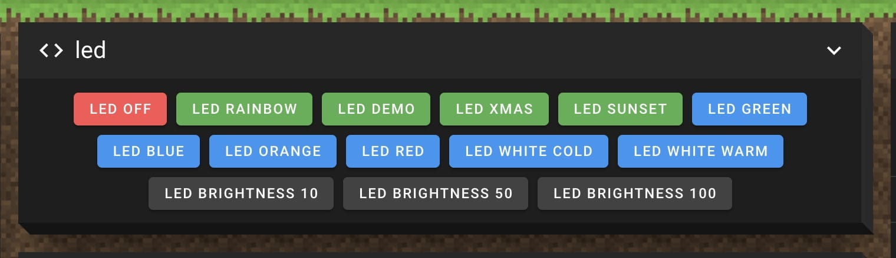

# vzbot
myvzbot

# led

This LED code support btf-lighting LED strip. To be specific, it supports WS2814 DC24V Led Strip Light 4 in 1, 5M 420LEDS, Black PCB, RGB WW IP67.

https://vi.aliexpress.com/item/1005004794429155.html?spm=a2g0o.order_list.order_list_main.212.525f18021J0lzq&gatewayAdapt=glo2vnm




```bash
cd ~/
git clone https://github.com/keefo/vzbot.git
./vzbot/led/setup.sh
```
